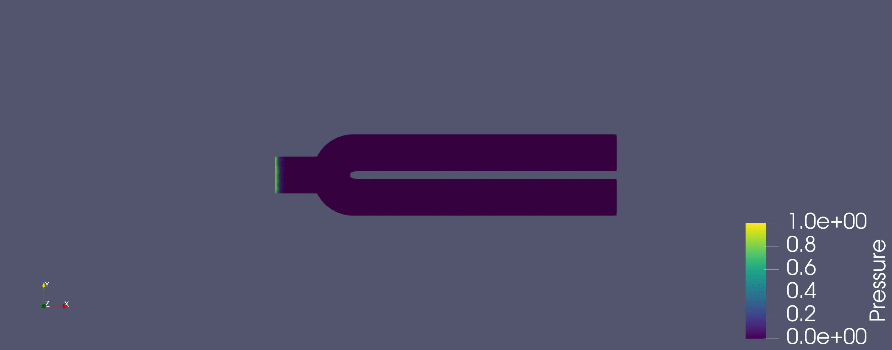

### Welcome!

A bit about me:

I am a PhD student at the University of Delaware in the Department of Mathematical Sciences.
I work on mathematical modelling on problems in physics and related fields, my current research project is uncertainty quantification in brittle fracture problems.

- Pronouns: He/Him
- ⚡ Fun facts: I enjoy snowboarding in the mountains and kayaking with my pup!

Here is a I made simulation of sound waves propagating through a set of exhaust tips using FEniCS

